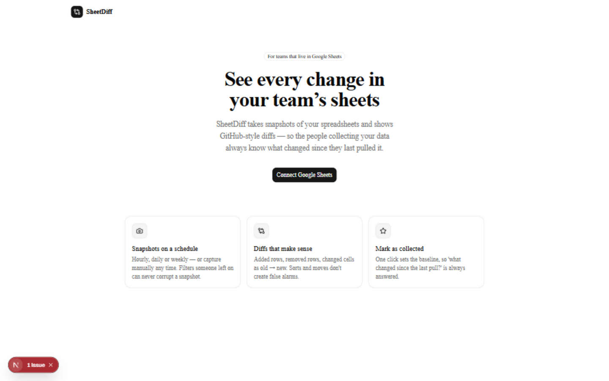
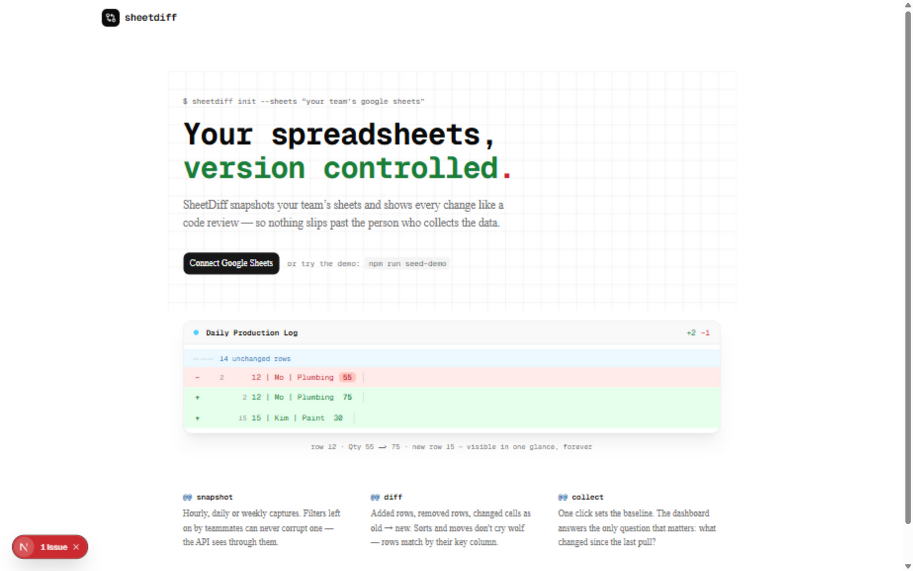
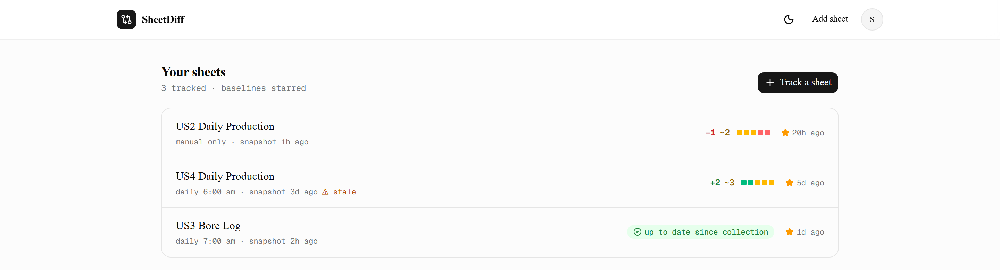
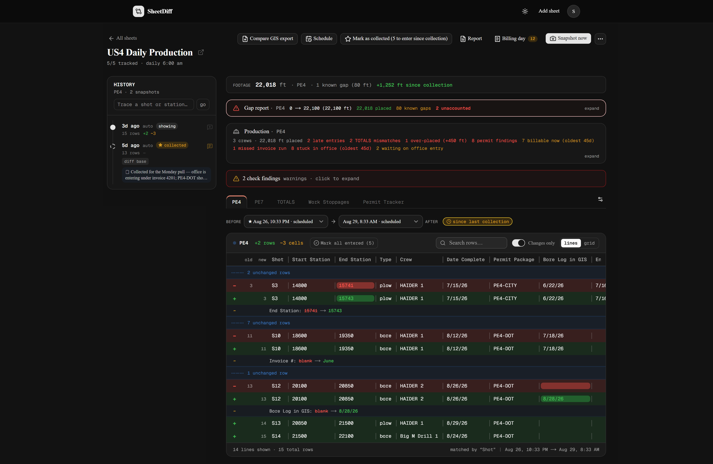
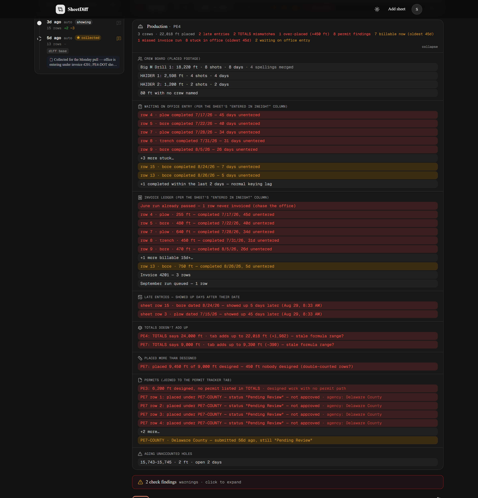

# SheetDiff — version tracking for Google Sheets

SheetDiff snapshots your team's Google Sheets and shows **GitHub-style diffs** between any two
snapshots — added rows, removed rows, changed cells as `old → new` — so the people who *collect*
your data always know what changed since they last pulled it.

[](LICENSE)



**The workflow it fixes:** a team enters data into shared sheets, a manager pulls that data daily
into another system (an ERP, GIS, anywhere). Someone fixes a number *after* the pull — the
manager never finds out, the downstream system goes stale. SheetDiff makes that change impossible
to miss: **"Mark as collected"** sets a baseline, and every change since shows up as a red badge
on the dashboard.

## Screenshots

| | |
|---|---|
|  |  |
|  |  |

## Highlights

- **Read-only by design.** SheetDiff connects with a Google scope that can read sheets but never
  modify them.
- **Filter-proof.** Snapshots are read through Google's API, which returns every row and column
  regardless of filters or filter views. Someone leaving a filter on cannot corrupt a snapshot.
- **Sort-proof.** Rows are matched between snapshots by a key column (auto-detected, or pick your
  own per tab). Sorting a sheet produces "moved" markers, never false changes.
- **No noise.** `40` vs `40.00` vs `$40` are the same number. Trailing blanks don't diff. Long
  text values get word-level diffs.
- **Checks (the gap linter).** Station-continuity breaks (`2 ft gap: row 3 ends at 15741 but
  row 4 starts at 15743`), duplicate shots, and the same key stranded in two tabs — caught on
  every snapshot. Understands plain feet and survey notation (`4+47`).
- **Audit workflow.** Attach notes explaining *why* things changed; tick changes off as
  *entered downstream*; download the unresolved changes as a CSV worklist; diff a GIS export
  (CSV/XLSX) against the sheet; get a daily digest email with everything still waiting to be
  collected.
- **Footage ledger.** Per-tab footage totals from your station columns, with the change since
  last collection — when a correction quietly moves your totals, you see the number move.
- **Scheduled or manual snapshots.** Hourly / daily at a time / weekly, or "Snapshot now".
- **GitHub-style UI.** Red/green `−/+` lines, changed-value annotations, diffstat blocks, a
  git-log timeline, code/table layouts, dark mode.

## Quick start

Requires Node.js 20+. Runs entirely on your machine — the data never leaves your SQLite file
and Google account.

```bash
git clone <this repo> && cd sheetdiff
npm install
cp .env.example .env       # then fill in APP_SECRET + Google credentials (below)
npm run db:push            # creates the SQLite database (data/sheetdiff.db)
npm run dev                # http://localhost:3000
```

`npm run setup` is a shortcut that creates `.env` with a random `APP_SECRET` for you.

### Try the demo (no Google needed)

```bash
npm run seed-demo
# set ENABLE_DEMO=1 in .env, restart the dev server,
# then open http://localhost:3000/auth/demo
```

This seeds a fake "US2 Daily Production" sheet whose snapshots tell a real audit story — a
wrong ending station (15741 → 15743, the 2 ft gap), a shot entered twice as plow *and* bore,
a survey-notation correction (164+80 → 164+82), and a shot stranded in two tabs for the
cross-tab check to catch. `ENABLE_DEMO` is opt-in and should stay off on any real deployment.

## Self-hosting (always-on)

Scheduled snapshots and the digest email run **while the app runs**. For anything shared,
run it somewhere that's always on.

**Docker (recommended):**

```bash
cp .env.example .env   # fill in
docker compose up -d --build
```

The database persists in `./data`. Behind a proxy with a domain? Set `APP_URL` and
`GOOGLE_REDIRECT_URI` in `.env` to match.

**Any always-on box:** a spare office PC, a home server, or a ~$5 VPS with Node 20+ works —
`npm ci && npm run build && npm start` (consider [pm2](https://pm2.io) or a systemd service to
keep it alive).

## Security notes

- Google OAuth only, with the **read-only** `spreadsheets.readonly` scope — SheetDiff cannot
  modify your sheets.
- Refresh tokens are encrypted at rest (AES-256-GCM, key derived from `APP_SECRET`).
- Single-workspace by design: every user signs in with Google; only sheets you add are tracked.
- `/auth/demo` requires `ENABLE_DEMO=1` and only knows about deliberately seeded demo data.
- Keep `.env` and `data/` out of backups you don't trust — snapshots contain your sheet data.

## Google setup (one-time, ~10 minutes)

SheetDiff needs its own OAuth client so it can read sheets with *your* account.

1. Go to [console.cloud.google.com](https://console.cloud.google.com/) and create a project
   (any name, e.g. "SheetDiff").
2. **APIs & Services → Library** → search for **Google Sheets API** → **Enable**.
3. **APIs & Services → OAuth consent screen**:
   - User type: **External**, create.
   - App name: anything (e.g. "SheetDiff"), add your email where asked.
   - You can skip scopes/branding; add yourself as a **test user** on the last step.
   - "Testing" mode is fine for a team — up to 100 test users, free.
4. **APIs & Services → Credentials → Create credentials → OAuth client ID**:
   - Application type: **Web application**
   - Authorized redirect URIs: add exactly `http://localhost:3000/auth/callback`
   - Create, then copy the **Client ID** and **Client secret**.
5. Put them in your `.env`:

   ```
   GOOGLE_CLIENT_ID=1234-abc.apps.googleusercontent.com
   GOOGLE_CLIENT_SECRET=your-secret
   GOOGLE_REDIRECT_URI=http://localhost:3000/auth/callback
   ```

6. Restart `npm run dev`, open the app, and click **Connect Google Sheets**.

The tool requests these scopes: `spreadsheets.readonly` (read sheet data), plus basic profile
(name/email/picture). It never asks for — and cannot use — write access.

## Using SheetDiff

1. **Add sheet** — paste a Google Sheets URL. Pick which tabs to track and (optionally) which
   column identifies rows on each tab; auto-detection usually gets it right. The first snapshot
   is taken immediately.
2. **Snapshot** — manually with *Snapshot now*, or set a schedule per sheet (Schedule button).
   Scheduled snapshots run while the app is running.
3. **Diff** — the sheet page shows the diff between any two snapshots (defaults to
   *last collection → latest*), rendered like a code review: red `−` lines, green `+` lines,
   and a `~ column: old → new` annotation spelling out every changed value. Timeline on the
   left; click an entry to diff up to it.
4. **Mark as collected** — after pulling data into your downstream system, click
   *Mark as collected* on the snapshot you pulled from. The dashboard then shows
   *"N changes since collection"* for each sheet — that badge is the whole point.

## Audit workflow features

- **Audit notes** — attach the *why* to any snapshot (timeline 💬 button) or changed row
  (per-row note button): "ending station was entered wrong — GIS has 15743, 2 ft gap". Notes
  appear next to the diff, in the timeline, and in the daily digest, so nobody has to dig
  through chat history.
- **Per-change acknowledgment** — hover any changed/added/removed row and click ✓ to mark it
  *entered downstream* (InEight or wherever). The dashboard counts what's still to enter;
  if a row changes again after being acknowledged, it re-flags itself automatically.
- **Checks (the gap linter)** — every snapshot runs station-continuity, duplicate-shot, and
  cross-tab checks: `2 ft gap: row 3 ends at 15741 but row 4 starts at 15743`,
  `"S3" appears 2× — duplicate shot?`, `"S5" appears in PE4 and PE7`. Station formats
  understood: plain feet (`15743`) and survey notation (`4+47`, `164+82`).
- **GIS import** — *Compare GIS export* takes a `.csv` or `.xlsx` export from your GIS and
  diffs it against the latest sheet snapshot: shots missing on either side, station
  mismatches, type disagreements. Excel tabs are matched to tracked tabs by name; CSV maps
  to a tab you pick. Imports appear in the timeline as `⭳ GIS import` entries.
- **Daily digest email** — account menu → *Daily digest…*: each morning, an email with what
  changed since the last collection, unresolved changes, check findings, footage movement, and
  audit notes. Needs SMTP settings in `.env` (Gmail App Password works — see the commented
  block in `.env`). Sent while the app is running.

## Development

```bash
npm test           # diff engine test suite (24 tests)
npm run db:push    # apply schema changes to the SQLite db
npm run build      # production build
```

Stack: Next.js (App Router) + TypeScript, Tailwind + shadcn/ui, SQLite via Drizzle ORM,
`googleapis` for OAuth + Sheets API, TanStack Virtual for large diff tables.

### Where things live

| Path | What |
|---|---|
| `src/lib/diff/engine.ts` | The diff engine — pure logic, fully unit-tested |
| `src/lib/diff/normalize.ts` | Value/key normalization (numeric equivalence etc.) |
| `src/lib/snapshots.ts` | Capture runs, gzip'd snapshot storage, schedule math |
| `src/lib/google.ts` | OAuth, token refresh + encrypted storage, Sheets reads |
| `src/lib/scheduler.ts` | In-process scheduler (checks every minute) |
| `src/lib/actions.ts` | Server actions (snapshot, baseline, schedule, settings) |
| `src/components/diff/diff-view.tsx` | The GitHub-style diff UI (client) |
| `data/sheetdiff.db` | SQLite database (snapshots as gzip'd JSON blobs) |

### How diffs stay honest

- Rows are identified by a **key column** when one exists (header like ID/Date/…, or any column
  whose values are unique). Without one, rows are matched by full-row content. Position is never
  used as identity — that's what makes re-sorts harmless.
- Columns are matched by header text, so inserting a column mid-sheet doesn't scramble cell
  pairing; a lone renamed header is paired instead of reported as remove+add.
- Values are compared trimmed, and numerically when both sides parse as numbers.
- Snapshots read via `values:batchGet` include every row/column regardless of filters — filters
  are a visual layer in Google Sheets, invisible to the API.

## Not in v1 (by design)

Excel *tracking* (imports are supported), direct InEight/ERP APIs, multi-workspace tenancy,
editing data, formula/formatting diffs. Each is a clean future addition — the data model and
scopes leave room.

## Contributing

Issues and PRs welcome — the diff engine (`src/lib/diff/`) and checks (`src/lib/checks.ts`)
are pure logic with full test suites, which makes them the friendliest place to start.
`npm test && npm run typecheck && npm run build` should pass before submitting.

## License

[MIT](LICENSE)
