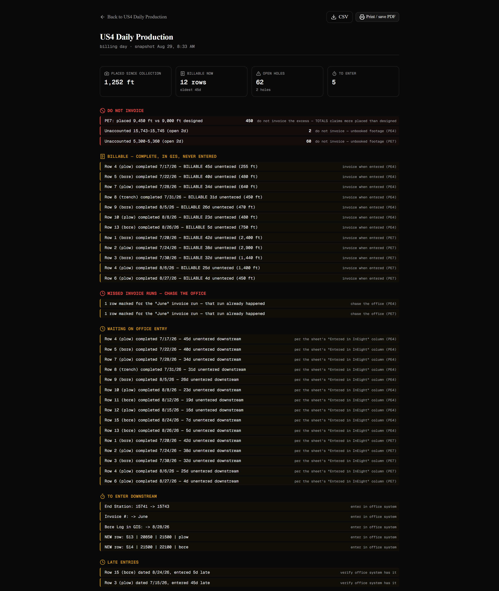
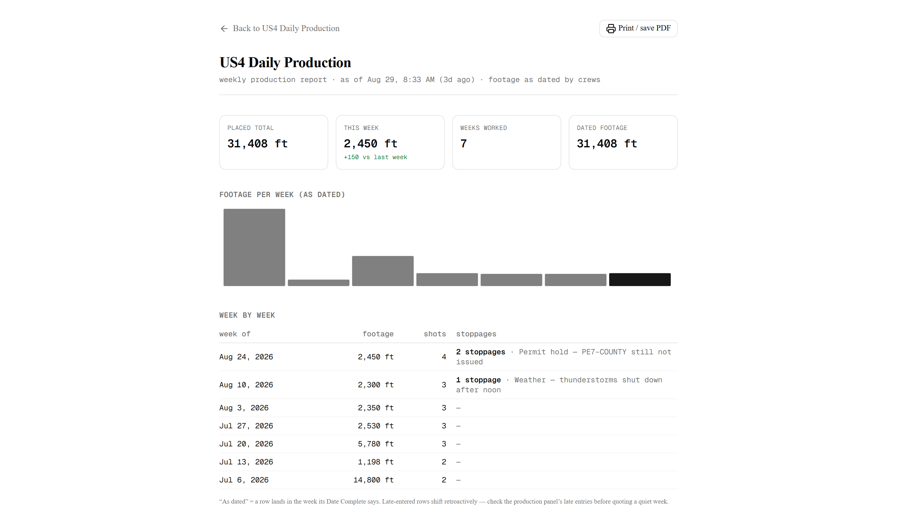

# SheetDiff — version tracking for Google Sheets

SheetDiff snapshots your team's Google Sheets and shows **GitHub-style diffs** between any two
snapshots — added rows, removed rows, changed cells as `old → new` — so the people who _collect_
your data always know what changed since they last pulled it.

**It works with any sheet.** Inventory, budgets, pipelines, logs, production trackers — the
core loop (snapshots → diffs → "what do I still need to enter?" → audit trail) is sheet-agnostic,
with smart row identifiers detected automatically. Utility construction was the proving ground, so
those sheets get extra math for free (footage chains, gap reports, billing packets) — every one of
those features activates only when your sheet carries the vocabulary for it, and stays out of the
way when it doesn't.

[](LICENSE)


**In one line:** automatic snapshots, human-readable diffs, and an audit trail of who changed what — with a gap linter that catches missing footage and overlapping stations in utility-construction production logs before invoicing or GIS upload. Self-hosted and open source: keep your spreadsheets, keep your data, gain the accountability enterprise trackers charge $40–150 per user per month for.

**The workflow it fixes:** a team enters data into shared sheets, a manager pulls that data daily
into another system (an ERP, GIS, anywhere). Someone fixes a number _after_ the pull — the
manager never finds out, the downstream system goes stale. SheetDiff makes that change impossible
to miss: **"Mark as collected"** sets a baseline, and every change since shows up as a red badge
on the dashboard.

## Screenshots

|                                              |                                            |
| -------------------------------------------- | ------------------------------------------ |
|          |       |
|              |        |
|  |  |

## Highlights

- **Read-only by design.** SheetDiff connects with a Google scope that can read sheets but never
  modify them.
- **Filter-proof.** Snapshots are read through Google's API, which returns every row and column
  regardless of filters or filter views. Someone leaving a filter on cannot corrupt a snapshot.
- **Sort-proof.** Rows are matched between snapshots by a key column (auto-detected, or pick your
  own per tab). Sorting a sheet produces "moved" markers, never false changes.
- **No noise.** `40` vs `40.00` vs `$40` are the same number. Trailing blanks don't diff. Long
  text values get word-level diffs.
- **Gap report.** Reconstructs each tab's footage chain (bore/plow/trench/gap rows only) and reconciles the math: placed + known gaps − overlaps vs. designed span.
- **Shot history.** Trace a single row through every snapshot by station number, free text, or key.
- **Checks (the gap linter).** Station-continuity breaks (`2 ft gap: row 3 ends at 15741 but
row 4 starts at 15743`), duplicate shots, and the same key stranded in two tabs — caught on
  every snapshot. Understands plain feet and survey notation (`4+47`).
- **Audit workflow.** Attach notes explaining _why_ things changed; tick changes off as
  _entered downstream_; download the unresolved changes as a CSV worklist; diff a GIS export
  (CSV/XLSX) against the sheet; get a daily digest email with everything still waiting to be
  entered in the office system.
- **Footage ledger.** Per-tab footage totals from your station columns, with the change since
  last collection — when a correction quietly moves your totals, you see the number move.
- **Scheduled or manual snapshots.** Hourly / daily at a time / weekly, or "Snapshot now".
- **GitHub-style UI.** Red/green `−/+` lines, changed-value annotations, diffstat blocks, a
  git-log timeline, code/table layouts, dark mode.

## Works with any sheet — smart identifiers, honest math

The same mechanism that matches "the 14800–15743 plow" across two snapshots on a construction
tracker matches "SKU A-100" on an inventory sheet or "Ticket 4021" on a support log. Every row
gets an identity through a hierarchy that needs **zero configuration**:

1. **Your choice** — pick a "Match rows by" column per tab (Tab settings → Match rows by). A pick
   that can't actually identify rows (values repeat or are blank) is validated and ignored, so a
   bad choice can't corrupt counts.
2. **Work identity** — activity + parsed station ranges, on sheets that carry stations
   (`164+82` ≡ `16,482` ≡ `16482`).
3. **Auto-detected ID column** — any column whose header says identifier (`ID`, `SKU`, `Ticket #`,
   `Order`, `Email`, `PO`, `Asset`, … — [the full vocabulary][vocab]) and whose values are
   populated and unique.
4. **Whole-row content** — always available as the fallback; also registered alongside the other
   tiers so a verbatim copy of a tab matches no matter how each side keyed its rows.

[vocab]: https://github.com/siaginw/sheetdiff/blob/main/src/lib/diff/engine.ts

That identity drives **everything**: diffing, acknowledgment tracking, compilation-tab detection
(a "Master List" that re-lists your working tab is tagged `copy` and counted zero times), and the
to-enter counts that agree across every surface. And the math stays honest on sheets without
stations — the billing packet says _"COULD NOT DETERMINE — no station columns (row-based sheet)"_
instead of a confident `0 ft`, while the to-enter worklist, late entries, and office backlog (if
your sheet tracks an "entered" column) work exactly the same as on a tracker.

## Accounting-grade accuracy

The numbers on a billing packet can cost real money, so v0.4 was hardened by a
five-agent audit that hand-verified every computation path — including a forensic
pass against a real 36-package production tracker — and then fixed everything it
found. The guarantees, each enforced by a permanent test suite:

- **One number, every surface.** The dashboard badge, the sheet page, all three
  CSV exports, the billing page, the weekly report, and the digest email are
  pinned to agree — a seeded fixture asserts every surface shows the same
  hand-computed counts, footage, holes, and billable rows, and that acking one
  row drops every surface by exactly one.
- **Compilation tabs can't double-bill.** Real trackers carry a "Line List" that
  re-lists the working tabs, sometimes reformatted (`2+14` for `214`, retyped
  crews). Rows are deduplicated by work identity — parsed stations, not cell
  text — with ownership applied consistently to baselines and history, so the
  same shot is counted exactly once everywhere. On the real tracker this took a
  +98% overbilling configuration to exactly the working tabs' numbers.
- **Byte-identical exports.** Timestamps, aging, and filenames derive from the
  data (the latest snapshot), never the export moment. Re-exporting unchanged
  data produces identical bytes — diff two exports to prove nothing changed.
- **Never silent.** Impossible dates ("Feb 30") surface as unreadable instead of
  rolling into March; keyed ledger entries that match no known bucket are shown
  rather than dropped; negative footage (corrections) reports honestly with a
  note; unknown footage says "COULD NOT DETERMINE", never a confident zero.
- **Undo you can trust.** "Mark as collected" remembers each tab's previous
  collection point and restores it exactly — acks, notes, and every number come
  back with it.
- **Hostile-input safe.** Formula-injection-guarded CSVs, zip-bomb-guarded
  imports, 130k-row sheets, NaN/Infinity stations, NUL bytes, DST and
  year boundaries — all fuzzed, all handled.

## Quick start

Requires Node.js 22+. Runs entirely on your machine — the data never leaves your SQLite file
and Google account.

```bash
git clone https://github.com/siaginw/sheetdiff.git && cd sheetdiff
npm install
npm run setup              # .env with a random APP_SECRET + data/ + the database
npm run dev                # http://localhost:3000 (add Google credentials to .env when ready)
```

Prefer filling in `.env` by hand? `cp .env.example .env`, then run `mkdir data && npm run db:migrate` —
`drizzle-kit push` alone crashes on a fresh clone (it does not create the `.db` directory).

### Try the demo (no Google needed)

```bash
npm run seed-demo
# set ENABLE_DEMO=1 in .env, restart the dev server,
# then open http://localhost:3000/auth/demo
```

This seeds a fake "US2 Daily Production" sheet whose snapshots tell a real audit story — a
wrong ending station (15741 → 15743, the 2 ft gap), a shot entered twice as plow _and_ bore,
a survey-notation correction (164+80 → 164+82), and a shot stranded in two tabs for the
cross-tab check to catch. It also seeds a demo _viewer_ — sign in at `/auth/demo?as=viewer`
to see exactly what a shared teammate (your data collector) sees. `ENABLE_DEMO` is opt-in and
should stay off on any real deployment.

## FAQ

**Is it free?** Yes — MIT license, no paid tier, no per-seat pricing. The only optional
cost is a ~$5/month VPS if you want it always on.

**Can it break or slow down my sheet?** No. SheetDiff uses Google's read-only scope
(`spreadsheets.readonly`) — the same view a "Viewer" collaborator has. It cannot edit
cells, and reads happen a few times a day through Google's API, so your team never
feels it.

**Who can see my data?** Whoever runs the machine it's on. Snapshots, notes, and Google
tokens live in one folder (`data/`) on that machine. Nothing is sent anywhere else.

**Do my crews need to change how they work?** No. They keep typing into the same shared
sheet. SheetDiff watches from outside — no add-on to install, no new tool to learn.

**What happens if I stop the server?** Nothing is lost. Every snapshot is already on
disk. Scheduled snapshots and digest emails pause while it's off and resume when it's
back (it captures the current state; it does not backfill missed hours).

**How far back does the history go?** By default the newest 200 snapshots per tab plus
every baseline ("collected") snapshot are kept — roughly 6 months daily or 8 days
hourly. Set `SHEETDIFF_KEEP_SNAPSHOTS=0` to keep everything forever.

**Can I track multiple sheets?** As many as you like — each gets its own schedule,
timeline, and badge.

**What if Google changes something?** SheetDiff reads through the public, stable Sheets
API v4 that thousands of tools depend on. If it ever breaks, every snapshot you've
already taken stays safe in your local database. Set `HEALTHCHECK_PING_URL` to get
alerted the moment captures stop.

**Can I get my data out?** Always. Everything lives in one SQLite file in `data/`, and
worklists/billing export to CSV from the UI. The software is MIT-licensed — it never
expires and there's no account to cancel.

**Do I need a Google Cloud account?** Just your normal Google account (a free Gmail
works) — you'll create a free one-time OAuth "client" so SheetDiff can read sheets
as you. Google doesn't charge for this.

**What's a "redirect URI"?** It tells Google where to send you after you log in.
Copy-paste `http://localhost:3000/auth/callback` exactly. If you later serve SheetDiff
at a real domain, add that domain's `/auth/callback` and set `GOOGLE_REDIRECT_URI`.

**Why read-only?** SheetDiff is a camera, not an editor. Read-only means the worst it
can ever do is look.

## Privacy

Self-hosted means YOU hold the data — snapshots, tokens, notes, everything lives in
your `data/` directory. Ship a policy for your users from the template in
[PRIVACY.md](PRIVACY.md).

## Self-hosting (always-on)

Scheduled snapshots and the digest email run **while the app runs**. For anything shared,
run it somewhere that's always on.

**Docker (recommended):**

```bash
cp .env.example .env   # fill in
docker compose up -d --build
```

The database persists in `./data`. Behind a proxy with a domain? Set `APP_URL` and
`GOOGLE_REDIRECT_URI` in `.env` to match.

**Any always-on box:** a spare office PC, a home server, or a ~$5 VPS with Node 22+ works —
`npm ci && npm run build && npm start` (consider [pm2](https://pm2.io) or a systemd service to
keep it alive).

## Security notes

- Google OAuth only, with the **read-only** `spreadsheets.readonly` scope — SheetDiff cannot
  modify your sheets.
- Refresh tokens are encrypted at rest (AES-256-GCM, key derived from `APP_SECRET`).
- Single-workspace by design: every user signs in with Google; only sheets you add are tracked.
- `/auth/demo` requires `ENABLE_DEMO=1` and only knows about deliberately seeded demo data.
- Keep `.env` and `data/` out of backups you don't trust — snapshots contain your sheet data.

## Google setup (one-time, ~10 minutes)

SheetDiff needs its own OAuth client so it can read sheets with _your_ account.

1. Go to [console.cloud.google.com](https://console.cloud.google.com/) and create a project
   (any name, e.g. "SheetDiff").
2. **APIs & Services → Library** → search for **Google Sheets API** → **Enable**.
3. **APIs & Services → OAuth consent screen**:
   - User type: **External**, create.
   - App name: anything (e.g. "SheetDiff"), add your email where asked.
   - You can skip scopes/branding.
   - **Publish the app to production (leave it unverified).** Do NOT leave the
     consent screen in "Testing": refresh tokens from Testing apps **expire
     after 7 days**, and an always-on snapshotter silently stops working a week
     in. A sensitive-but-not-restricted scope like `spreadsheets.readonly` runs
     fine unverified — your users click through the "app not verified" warning
     once. (Google Workspace _internal_ user type skips the warning entirely if
     all your users share your Workspace.) Each SheetDiff install uses its own
     project, so the 100-user cap never binds.
4. **APIs & Services → Credentials → Create credentials → OAuth client ID**:
   - Application type: **Web application**
   - Authorized redirect URIs: add exactly `http://localhost:3000/auth/callback`
   - Create, then copy the **Client ID** and **Client secret**.
5. Put them in your `.env`:

   ```
   GOOGLE_CLIENT_ID=1234-abc.apps.googleusercontent.com
   GOOGLE_CLIENT_SECRET=your-secret
   GOOGLE_REDIRECT_URI=http://localhost:3000/auth/callback
   ```

6. Restart `npm run dev`, open the app, and click **Connect Google Sheets**.

The tool requests these scopes: `spreadsheets.readonly` (read sheet data), plus basic profile
(name/email/picture). It never asks for — and cannot use — write access.

## Using SheetDiff

1. **Add sheet** — paste a Google Sheets URL. Pick which tabs to track and (optionally) which
   column identifies rows on each tab; auto-detection usually gets it right. The first snapshot
   is taken immediately.
2. **Snapshot** — manually with _Snapshot now_, or set a schedule per sheet (Schedule button).
   Scheduled snapshots run while the app is running.
3. **Diff** — the sheet page shows the diff between any two snapshots (defaults to
   _last collection → latest_), rendered like a code review: red `−` lines, green `+` lines,
   and a `~ column: old → new` annotation spelling out every changed value. Timeline on the
   left; click an entry to diff up to it.
4. **Mark as collected** — after pulling data into your downstream system, click
   _Mark as collected_ on the snapshot you pulled from. The dashboard then shows
   _"N changes since collection"_ for each sheet — that badge is the whole point.

## Audit workflow features

- **Audit notes** — attach the _why_ to any snapshot (timeline 💬 button) or changed row
  (per-row note button): "ending station was entered wrong — GIS has 15743, 2 ft gap". Notes
  appear next to the diff, in the timeline, and in the daily digest, so nobody has to dig
  through chat history.
- **Per-change acknowledgment** — hover any changed/added/removed row and click ✓ to mark it
  _entered downstream_ (InEight or wherever). The dashboard counts what's still to enter;
  if a row changes again after being acknowledged, it re-flags itself automatically.
- **"Mark as collected" + exact undo** — one click re-baselines the whole sheet and drops
  every to-enter count to zero; the banner that follows offers _Undo_, which restores each
  tab's previous collection point exactly (acks and notes survive either way).
- **Compilation-tab aware** — tabs that re-list other tabs (a "Line List") are tagged
  `copy` and counted zero times: every rollup, every to-enter count, and the digest read
  the working tabs. The few reformatted rows a copy carries that no working tab shows
  appear as a check finding instead of vanishing.
- **Checks (the gap linter)** — every snapshot runs station-continuity, duplicate-shot, and
  cross-tab checks: `2 ft gap: row 3 ends at 15741 but row 4 starts at 15743`,
  `"S3" appears 2× — duplicate shot?`, `"S5" appears in PE4 and PE7`. Station formats
  understood: plain feet (`15743`) and survey notation (`4+47`, `164+82`).
- **GIS import** — _Compare GIS export_ takes a `.csv` or `.xlsx` export from your GIS and
  diffs it against the latest sheet snapshot: shots missing on either side, station
  mismatches, type disagreements. Excel tabs are matched to tracked tabs by name; CSV maps
  to a tab you pick. Imports appear in the timeline as `⭳ GIS import` entries.
- **Entry queue export** — one CSV row per _shot_ in the tab's own column order, oldest
  introduction first: the typing list for the office system, not a cell-change log. Removed
  rows ship as delete-downstream summaries.
- **Weekly production report** — `…/report`: footage per week (as dated by crews),
  week-over-week delta, printable one-pager.
- **Daily/weekly digest email** — account menu → _Digest email…_: pick daily or a weekday, and
  each send includes what changed since the last collection, unresolved changes, check findings,
  footage movement, and audit notes. Needs SMTP settings in `.env` (Gmail App Password works — see the commented block in `.env.example`).

For deliverability on your own domain, consider signing with DKIM — nodemailer
supports it via `dkim: { domainName, keySelector, privateKey }` transport options
(see nodemailer.com/dkim).

- **Production report.** Date hygiene, backdated late entries, TOTALS-tab reconciliation, a per-crew per-day footage board, and an aging ledger of unaccounted holes — generated from the snapshots you already take. The **invoice ledger** reads your sheet's own "Entered in InEight" + "Invoice #" columns: what's billable right now (aged, with footage), what's billed under which invoice number, and runs already missed.
- **Billing-day packet.** Placed footage since collection, open holes (do-not-invoice),
  over-placement warnings (TOTALS Placed beyond Designed), the office-entry backlog per the
  sheet's own "entered" column, the to-enter worklist, and late entries in one CSV —
  stamped with its snapshot and run id, and byte-identical on re-export (every timestamp
  and age derives from the data, never the download).
- **Monitoring.** Set `HEALTHCHECK_PING_URL` (see `.env.example`) to a free healthchecks.io monitor and get alerted if snapshots ever silently stop.

**When the app seems quiet:** check `docker compose logs sheetdiff` for `[scheduler]` errors (most common: revoked Google token — re-authenticate via the app), verify `curl localhost:3000/api/health` shows `"ok":true` (a non-zero `staleCaptures` means scheduled snapshots are overdue — the pages still render from old data, so this is often the first visible sign), check disk space (`data/backups/` grows), and confirm the container is running (`docker ps`). To restore: stop the container, copy the newest `data/backups/sheetdiff-YYYY-MM-DD.db` over `data/sheetdiff.db` (delete the `-wal` and `-shm` siblings), restart.

- **Self-maintaining data** — automatic nightly backups (`data/backups/`, keep 14 by default)
  and snapshot retention (keep the newest 200 per tab, baselines always kept). Both tunable via
  `SHEETDIFF_KEEP_SNAPSHOTS` / `SHEETDIFF_BACKUPS` in `.env`.
- **Sharing** — account menu → _Share access…_: add teammates by email. When they sign in with
  that Google account they see your sheets, read diffs and audit notes, tick changes off as
  entered, and mark collections — the exact workflow of the person collecting your data —
  while all destructive controls (schedules, imports, deletes, settings) stay owner-only.

## Updating your deployment

New version shipped? That's all you do:

```bash
git pull
docker compose up -d --build
```

The container applies any database migrations automatically on startup. Your data lives in `./data` and is never touched beyond additive schema changes — the app also keeps nightly copies in `./data/backups/`.

Running without Docker? Same two steps minus Docker: `git pull && npm ci && npm run build && npm restart`.

First start on Linux: Docker creates `./data` as root if the folder is missing, which the in-container app user can't write to. Create it once: `mkdir -p data && sudo chown 1000:1000 data`.

## Development

```bash
npm run verify       # everything CI checks: format + lint + typecheck + tests — run before pushing
npm test             # the domain suite alone (367 tests: engine, checks, gaps, dedupe, billing, DB gates)
npm run test:coverage # the suite with v8 coverage and enforced thresholds
npm run format       # Prettier (also runs automatically on staged files via the pre-commit hook)
npm run knip         # dead code / unused exports sweep
npm run db:generate  # turn schema edits into a committed migration (applied on next start)
npm run build        # production build
```

Commits run lint-staged (ESLint --fix + Prettier on staged files); hooks are skipped in CI.

Stack: Next.js (App Router) + TypeScript, Tailwind + shadcn/ui, SQLite via Drizzle ORM,
`googleapis` for OAuth + Sheets API, TanStack Virtual for large diff tables.

### Where things live

| Path                                | What                                                      |
| ----------------------------------- | --------------------------------------------------------- |
| `src/lib/diff/engine.ts`            | The diff engine — pure logic, fully unit-tested           |
| `src/lib/diff/normalize.ts`         | Value/key normalization (numeric equivalence etc.)        |
| `src/lib/snapshots.ts`              | Capture runs, gzip'd snapshot storage, schedule math      |
| `src/lib/google.ts`                 | OAuth, token refresh + encrypted storage, Sheets reads    |
| `src/lib/scheduler.ts`              | In-process scheduler (checks every minute)                |
| `src/lib/actions.ts`                | Server actions (snapshot, baseline, schedule, settings)   |
| `src/components/diff/diff-view.tsx` | The GitHub-style diff UI (client)                         |
| `src/lib/gaps.ts`                   | Auto gap report — chain reconstruction and reconciliation |
| `src/lib/detect.ts`                 | Station parsing + column auto-detection                   |
| `src/lib/production.ts`             | Production analytics — dates, crews, TOTALS, aging        |
| `src/lib/billing.ts`                | The billing-day packet                                    |
| `src/lib/db/migrate.ts`             | Startup migrations (legacy DBs stamped non-destructively) |
| `data/sheetdiff.db`                 | SQLite database (snapshots as gzip'd JSON blobs)          |

### How diffs stay honest

- Rows are identified by a **key column** when one exists (header like ID/Date/…, or any column
  whose values are unique). Without one, rows are matched by full-row content. Position is never
  used as identity — that's what makes re-sorts harmless.
- Columns are matched by header text, so inserting a column mid-sheet doesn't scramble cell
  pairing; a lone renamed header is paired instead of reported as remove+add.
- Values are compared trimmed, and numerically when both sides parse as numbers.
- Snapshots read via `values:batchGet` include every row/column regardless of filters — filters
  are a visual layer in Google Sheets, invisible to the API.

## Not in v1 (by design)

Excel _tracking_ (imports are supported), direct InEight/ERP APIs, multi-workspace tenancy,
editing data, formula/formatting diffs. Each is a clean future addition — the data model and
scopes leave room.

## Contributing

Issues and PRs welcome — the diff engine (`src/lib/diff/`) and checks (`src/lib/checks.ts`)
are pure logic with full test suites, which makes them the friendliest place to start.
`npm test && npm run typecheck && npm run build` should pass before submitting.

## License

[MIT](LICENSE)
